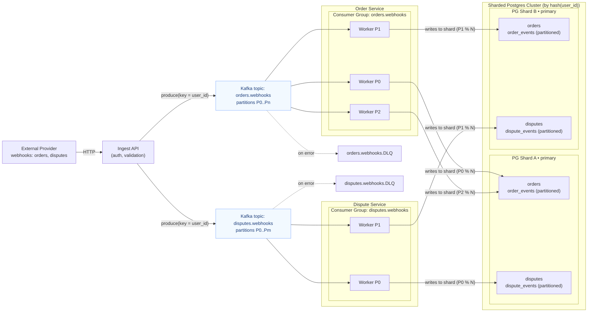

# Payment Manager

**Payment Manager** is a backend service that simulates a merchant system integrated with external payment providers.  
It receives and processes webhook events related to orders and disputes.

## Tech Stack
Go, PostgreSQL, pg_partman, Docker, MongoDB, OpenSearch, Kafka, testcontainers-go, Citus, WireMock

# Goals

- Practice database scaling: time-series partitioning, sharding, replication, and queues.
- Experiment with multiple database systems
- Write high-quality Golang code
- Include thorough testing: unit, integration, and end-to-end tests
- Practice metrics collection and benchmarking configurations. 

# Not Goals

- A rational or production-ready domain design 
- Solving real-world fintech problems
- Achieving real performance gains from scaling (metrics and benchmarks here are for learning, not for driving design decisions)

# Status
Earlier experiments: [Postgres Time Series Partitioning Notes](./Postgres%20Time%20Series%20Partitioning%20Notes.md).

Currently working on **webhook ingestion with Kafka**.

# Roadmap

## Step 1: Webhooks ingestion with Kafka

### Schema

### Plan

- Process webhooks with a queue
  - [ ] Webhook endpoints publish to two topics: orders.webhooks, disputes.webhooks, keyed by user_id.
  - [ ] Add event_id to envelope for idempotency.
- Workers
  - [ ] Run 2 workers to consume and process these topics.
  - [ ] Ensure idempotent writes in DB (UPSERT / ON CONFLICT on event_id or natural key).
- Ingest Service 
   - [ ] Extract webhook handling into a separate service.
   - [ ] Add auth + schema validation (JSON Schema / Protobuf).
   - [ ] Invalid/unprocessable messages → DLQ with reason.
- Scale-out
   - [ ] Increase topic partitions; scale workers (1 worker per partition)..
   - [ ] Verify consistent routing by hash(user_id) across producers/consumers.

## Step 2: Outbox pattern → CDC → Analytics

## Step 3: Sharding experiments
