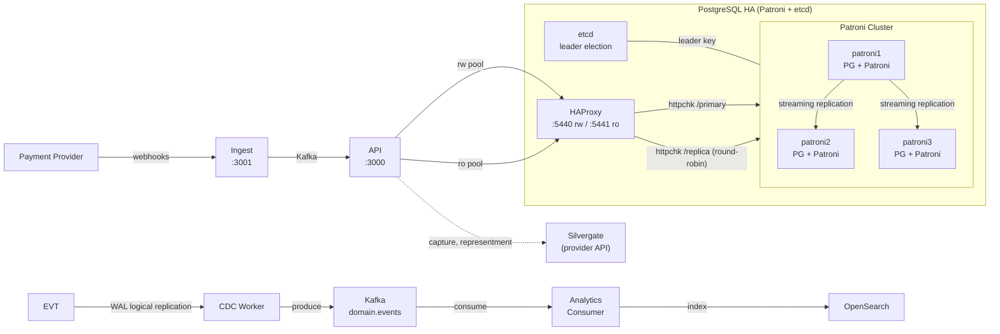

# Payment Manager

**Payment Manager** is a backend service that simulates a merchant system integrated with external payment providers.  
It receives and processes webhook events related to orders and disputes.

## Tech Stack
Go, PostgreSQL, pg_partman, Docker, MongoDB, OpenSearch, Kafka, testcontainers-go, Citus, WireMock

# Goals

- Practice database scaling: time-series partitioning, sharding, replication, and queues
- Experiment with multiple database systems
- Write high-quality Golang code
- Include thorough testing: unit, integration, and end-to-end tests
- Practice metrics collection and benchmarking configurations
- Extensibility in the architecture of application and infrastructure
- Host simplified version on VPS


# Not Goals

- A rational or production-ready domain design 
- Solving real-world fintech problems
- Achieving real performance gains from scaling (metrics and benchmarks here are for learning, not for driving design decisions)

# Status

Building **PostgreSQL HA** — Patroni + etcd cluster (3 identical PG nodes with automated failover), HAProxy for rw/ro traffic splitting via Patroni REST API health checks, app-level read/write routing at repository level. Monitoring with postgres-exporter and Grafana dashboard for replication lag and HAProxy metrics.

# Roadmap

Detailed plan with checkpoints: **[docs/roadmap.md](./docs/roadmap.md)**

# Notes
- [Postgres Time Series Partitioning Notes](./Postgres%20Time%20Series%20Partitioning%20Notes.md) - Query optimization with pg_partman
- [Claude Code Workflow Notes](./Claude%20Code%20Workflow%20Notes.md) - How I use Claude Code to accelerate learning

# Architecture


```mermaid
flowchart LR
  EXT["Payment Provider"]
    -->|webhooks| ING["Ingest<br/>:3001"]

  ING -->|Kafka| API["API<br/>:3000"]

  subgraph PG["PostgreSQL HA (Patroni + etcd)"]
    direction TB
    ETCD["etcd<br/>leader election"]
    HAP["HAProxy<br/>:5440 rw / :5441 ro"]
    subgraph PAT["Patroni Cluster"]
      P1["patroni1<br/>PG + Patroni"]
      P2["patroni2<br/>PG + Patroni"]
      P3["patroni3<br/>PG + Patroni"]
    end
    ETCD ---|leader key| PAT
    HAP -->|"httpchk /primary"| PAT
    HAP -->|"httpchk /replica (round-robin)"| PAT
    P1 -->|streaming replication| P2
    P1 -->|streaming replication| P3
  end
  API -->|rw pool| HAP
  API -->|ro pool| HAP

  EVT -->|WAL logical replication| CDC["CDC Worker"]
  CDC -->|produce| TOPIC["Kafka<br/>domain.events"]
  TOPIC -->|consume| AN["Analytics<br/>Consumer"]
  AN -->|index| OS["OpenSearch"]

  API -.->|capture, representment| SG["Silvergate<br/>(provider API)"]
```

| Service | Path | Description |
|---------|------|-------------|
| **API** :3000 | `services/api/cmd` | Core business logic, DB owner, Kafka consumers, manual ops |
| **Ingest** :3001 | `services/ingest/cmd` | HTTP → Kafka gateway for webhooks, no DB |
| **CDC Worker** | `services/cdc/cmd` | PG WAL → Kafka `domain.events` via logical replication |
| **Analytics** | `services/analytics/cmd` | Kafka → OpenSearch `domain-events` projection |

# Domain Entities

## Order
Payment order from external provider.

| Field | Description |
|-------|-------------|
| `order_id` | Provider's order identifier |
| `user_id` | Customer UUID |
| `status` | `created` → `updated` → `success` / `failed` |
| `on_hold` | Manual hold flag |
| `hold_reason` | `manual_review` or `risk` |

**Events:** `webhook_received`, `hold_set`, `hold_cleared`, `capture_requested`, `capture_completed`, `capture_failed`

## Dispute
Chargeback/dispute linked to an order.

| Field | Description |
|-------|-------------|
| `dispute_id` | Internal dispute identifier |
| `order_id` | FK to related order |
| `status` | `open` → `under_review` → `submitted` → `won` / `lost` / `closed` / `canceled` |
| `reason` | Dispute reason from provider |
| `amount`, `currency` | Disputed amount |
| `evidence_due_at` | Deadline for evidence submission |

**Events:** `webhook_opened`, `webhook_updated`, `provider_decision`, `evidence_submitted`, `evidence_added`

## State Machines

```
Order:   created ──→ updated ──→ success
                           └──→ failed

Dispute: open ──→ under_review ──→ submitted ──→ won
                                          └──→ lost
                                          └──→ closed
                       └──→ canceled
```

# Load Testing

Generate realistic data by sending webhook sequences through the full Ingest → API flow.

```bash
# Start services first
make run-dev

# Run load test (default: 10 VUs, 30s)
make loadtest

# Custom parameters
go run ./loadtest -vus 50 -duration 2m -dispute-ratio 0.5
```

Each virtual user creates orders (full lifecycle: created → updated → success/failed) and disputes (30% of successful orders). After running, the database will contain orders, disputes, and their event histories.

# Monitoring

Monitoring starts automatically with `make start_containers` (part of `infra` profile).

- **Prometheus** :9090 — scrapes API, Ingest, HAProxy, postgres-exporter
- **Grafana** :3100 (admin/admin) — dashboards:
  - [Service Health](http://localhost:3100/d/service-health) — HTTP latency, error rates, Kafka throughput
  - [PostgreSQL HA](http://localhost:3100/d/postgres-ha) — replication lag, HAProxy sessions, PG connections
- **HAProxy stats** :8404/stats — backend health, session distribution
- **postgres-exporter** :9187 — PG replication, activity, database size metrics