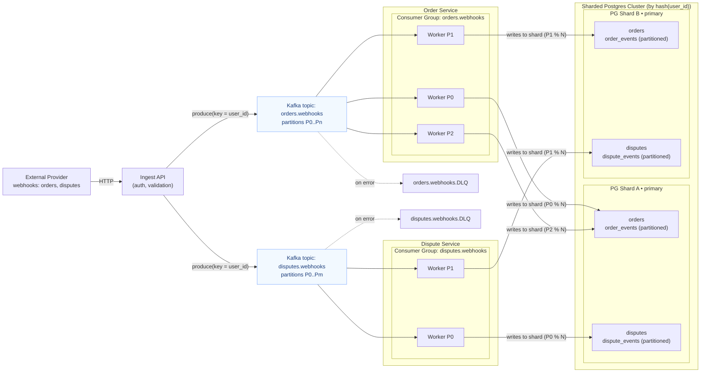

# Feature 001: Webhooks Ingestion with Kafka

**Status:** In Progress

## Overview

Replace synchronous webhook processing with Kafka-based async ingestion.

## Architecture

## Tasks

### Phase 1: Basic Kafka Integration
- [ ] Webhook endpoints publish to two topics: orders.webhooks, disputes.webhooks, keyed by user_id
- [ ] Add event_id to envelope for idempotency

### Phase 2: Workers
- [ ] Run 2 workers to consume and process these topics
- [ ] Ensure idempotent writes in DB (UPSERT / ON CONFLICT on event_id or natural key)

### Phase 3: Ingest Service
- [ ] Extract webhook handling into a separate service
- [ ] Add auth + schema validation (JSON Schema / Protobuf)
- [ ] Invalid/unprocessable messages → DLQ with reason

### Phase 4: Scale-out
- [ ] Increase topic partitions; scale workers (1 worker per partition)
- [ ] Verify consistent routing by hash(user_id) across producers/consumers

## Notes

### 2025-12-27: Pre-Kafka Groundwork (Preparation Phase)

**Completed:** Idempotency infrastructure fixes before Kafka integration

**Changes:**
- ✅ Added UNIQUE constraints for idempotency:
  - `order_events(order_id, provider_event_id)`
  - `dispute_events(dispute_id, provider_event_id, created_at)` *(includes partition key)*
- ✅ Fixed event creation error handling:
  - Events are now critical operations (webhook fails if event creation fails)
  - Repositories return `apperror.ErrEventAlreadyStored` on duplicate
  - Handlers properly check for duplicates via `errors.Is()`
- ✅ Fixed binding error handling in webhook handlers (added missing `return` statements)
- ✅ Added integration tests:
  - `TestCreateOrderEvent_IdempotencyConstraint` (order_eventsink)
  - `TestCreateDisputeEvent_IdempotencyConstraint` (dispute_eventsink)
- ✅ Created `.claude/rules/migrations.md` for migration testing standards

**Why this matters for Kafka:**
- Kafka consumers will retry failed messages
- UNIQUE constraints + webhook retry = safe idempotency
- Without these fixes, retries would create duplicate events

**Migration:** `20251227102937_add_idempotency_constraints.sql`

**Next:** Ready for Phase 1 - Basic Kafka Integration
