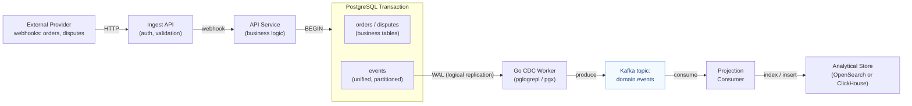

# Step 3: Outbox Pattern → CDC → Analytics

**Status:** Paused

## Overview

Reliable event publishing via the Outbox pattern with a custom Go CDC pipeline (PostgreSQL logical replication) streaming events into an analytical store.

**Core idea:** Currently, domain events (order/dispute state changes) are only stored in PostgreSQL event tables. There is no mechanism to reliably publish these events to external consumers (analytics, notifications, other services). The Outbox pattern solves this: write an event row within the same transaction as the business data, then a Go CDC worker tails the WAL via logical replication and publishes events to Kafka, guaranteeing at-least-once delivery without distributed transactions.

**Motivation:**
- Current system only writes events to PostgreSQL (`order_events`, `dispute_events`) — no external publishing
- If we add Kafka publishing alongside DB writes, we get dual-write problem (DB commits but Kafka fails → inconsistency)
- Outbox pattern avoids dual-write by keeping everything in one transaction
- CDC is a fundamental building block for event-driven architectures
- Analytical projections (OpenSearch/ClickHouse) demonstrate read-model separation (CQRS-lite)

## Architecture



### Flow

| Step | What happens |
|------|-------------|
| 1 | Webhook arrives at Ingest, forwarded to API |
| 2 | API writes business data + event row **in one transaction** |
| 3 | Go CDC worker reads PostgreSQL WAL via logical replication slot (pgoutput) |
| 4 | CDC worker publishes event to Kafka topic |
| 5 | Projection consumer reads Kafka, writes to analytical store |

### Strangler Fig Migration

Existing `order_events` / `dispute_events` tables remain untouched. A new unified `events` table is created alongside them. Writes go to both (old + new) in the same transaction. Once CDC pipeline and new read paths are ready, old tables are dropped.

## Key Concepts to Practice

- **Outbox pattern** — transactional event publishing, unified event table
- **Change Data Capture** — PostgreSQL logical replication, replication slots, pgoutput protocol, LSN tracking
- **Go CDC implementation** — `pglogrepl` / `pgx` replication API, WAL message parsing
- **Exactly-once semantics** — idempotent consumers, deduplication strategies, tradeoffs
- **Event projections** — building read-optimized views from event streams
- **Analytical indexing** — OpenSearch or ClickHouse as analytical store
- **Strangler Fig pattern** — gradual migration from old to new event tables

## Tasks

- [x] Subtask 1: Transactor refactoring — services own transactions
- [x] Subtask 2: Unified events table + atomic writes
- [x] Subtask 3: Go CDC worker — WAL tailing via logical replication + Analytics consumer
  - PostgreSQL logical replication setup (publication, replication slot, `wal_level=logical`)
  - Replication connection via `pglogrepl` — start streaming, receive WAL messages
  - pgoutput protocol decoding — Relation messages, Insert/Update/Delete → domain events
  - Kafka publishing — serialize decoded events, produce to `domain.events` topic
  - LSN tracking + standby status heartbeats — acknowledge processed WAL position
  - Graceful shutdown — close replication slot cleanly, flush pending messages
  - Analytics consumer — Kafka `domain.events` → OpenSearch `domain-events` index
  - Old OpenSearch stub removed, APIConfig cleaned up
- [ ] Subtask 4: Partitioning for unified events table (pg_partman)
- [ ] Subtask 5: TBD

## Notes

- CDC approach: custom Go worker using PostgreSQL logical replication (not Debezium) — deeper understanding of how CDC works under the hood
- Unified `events` table replaces separate `order_events` / `dispute_events` via Strangler Fig migration
- `dispute_events` is already partitioned (pg_partman, daily by `created_at`) — new table will use same approach
- `publish_via_partition_root = true` needed for logical replication from partitioned tables
- Consider what analytical queries we want to answer — this drives the projection schema
- Evaluate ClickHouse vs OpenSearch for the analytical store

## Changelog

### Subtask 1: Transactor refactoring + naming cleanup

**Transactor pattern:**
- Added `postgres.Transactor` interface (`pkg/postgres/postgres.go`)
- Services own transactions: `s.transactor.InTransaction(ctx, func(tx postgres.Executor) error)`
- Tx-scoped repo factories: `order_repo.TxRepoFactory(builder)`, `dispute_repo.TxRepoFactory(builder)`

**Interface cleanup:**
- Removed `InTransaction` from `OrderRepo`/`DisputeRepo` interfaces
- Collapsed `OrderRepo`+`TxOrderRepo` → single `OrderRepo` (same for dispute)
- Removed repo-level `TestInTransaction` tests (were testing test wrappers, not production code)

**Naming cleanup:**
- `PaymentWebhook` → `OrderUpdate`, `ProcessPaymentWebhook` → `ProcessOrderUpdate`
- `EventSink` → `OrderEvents` / `DisputeEvents`
- `txRepoFactory` → `txOrderRepo` / `txDisputeRepo`
- Ingest Processor: `ProcessOrderWebhook`/`ProcessDisputeWebhook` → `ProcessOrderUpdate`/`ProcessDisputeUpdate`

**Current service structure (OrderService):**
```go
type OrderService struct {
    transactor    postgres.Transactor
    txOrderRepo   func(tx postgres.Executor) OrderRepo
    orderRepo     OrderRepo
    provider      gateway.Provider
    orderEvents   OrderEvents
}
```

### Subtask 2: Unified events table + atomic writes

**Migration:**
- New `events` table: `(id UUID PK, aggregate_type, aggregate_id, event_type, idempotency_key, payload JSONB, created_at)`
- Unique index: `(aggregate_type, aggregate_id, idempotency_key)` for idempotent writes
- Lookup indices: `(aggregate_type, aggregate_id, created_at)`, `(event_type, created_at)`
- No partitioning yet (separate subtask), no foreign keys (generic aggregate_id)

**Domain types:**
- `internal/api/domain/events/` — `AggregateType`, `NewEvent`, `Event`, `Store` interface, `ErrEventAlreadyStored`

**Event store:**
- `internal/api/repo/events/PgEventStore` — INSERT with unique violation → `ErrEventAlreadyStored`
- `TxStoreFactory(builder)` — partial application factory for tx-scoped stores

**Atomic writes (outbox pattern):**
- Services write to unified `events` table **inside** the same transaction as business data
- `txEventStore := s.txEventStore(tx)` in every `InTransaction` callback
- Duplicate events silently ignored (idempotent `writeEvent` helper)
- Old `order_events`/`dispute_events` writes remain unchanged (Strangler Fig)

**Updated service structure:**
```go
type OrderService struct {
    transactor   postgres.Transactor
    txOrderRepo  func(tx postgres.Executor) OrderRepo
    txEventStore func(tx postgres.Executor) events.Store  // NEW
    orderRepo    OrderRepo
    provider     gateway.Provider
    orderEvents  OrderEvents
}
```

### Subtask 3: CDC worker + Analytics consumer

**CDC worker (`cmd/cdc`, `internal/cdc/`):**
- Connects to PG via logical replication (`pglogrepl`), tails WAL from `events` table
- Decodes pgoutput INSERT messages → `walEvent` struct
- Publishes JSON to Kafka `domain.events` topic (key = `aggregate_id`)
- Retry loop with exponential backoff on replication failures
- Standby heartbeats every 10s to keep replication slot alive

**Analytics consumer (`cmd/analytics`, `internal/analytics/`):**
- New standalone service — Kafka consumer group `analytics-projection`
- Reads from `domain.events`, indexes into OpenSearch `domain-events` index
- Idempotent: uses event `id` as OpenSearch `_id` (re-index = overwrite)
- `ensureIndex()` creates index with mapping on startup if missing
- PG timestamp normalization (`2026-02-14 11:51:37+00` → RFC 3339)
- Manual commit: FetchMessage → unmarshal → indexEvent → CommitMessages

**Cleanup:**
- Deleted old unused `internal/api/external/opensearch/` stub
- Removed `OpensearchUrls`, `OpensearchIndexDisputes`, `OpensearchIndexOrders` from `APIConfig`

**New files:**
- `cmd/analytics/main.go` — entry point
- `internal/analytics/event.go` — event struct + `normalizeTimestamp()`
- `internal/analytics/indexer.go` — OpenSearch client
- `internal/analytics/app.go` — `Run()` with consumer loop
- `config/config.go` — `AnalyticsConfig`
- `env/analytics.env`, `Procfile` updated
