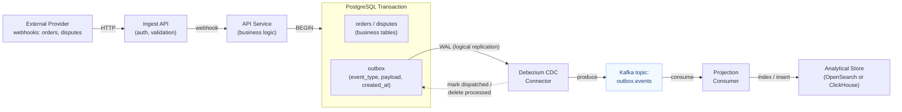

# Step 3: Outbox Pattern → CDC → Analytics

**Status:** Planning

## Overview

Reliable event publishing via the Outbox pattern with Change Data Capture (CDC) pipeline streaming events into an analytical store.

**Core idea:** Instead of dual-writing to both PostgreSQL and Kafka (which breaks atomicity), write events to an `outbox` table within the same transaction as the business data. A CDC connector (Debezium) tails the WAL and publishes outbox rows to Kafka, guaranteeing at-least-once delivery without distributed transactions.

**Motivation:**
- Current system does dual-write (DB + Kafka publish) — if Kafka publish fails after DB commit, the event is lost
- Outbox pattern solves this with transactional guarantees
- CDC is a fundamental building block for event-driven architectures
- Analytical projections (OpenSearch/ClickHouse) demonstrate read-model separation (CQRS-lite)

## Architecture

### Flow

| Step | What happens |
|------|-------------|
| 1 | Webhook arrives at Ingest, forwarded to API |
| 2 | API writes business data + outbox row **in one transaction** |
| 3 | Debezium tails PostgreSQL WAL, picks up new outbox rows |
| 4 | Debezium publishes event to Kafka topic |
| 5 | Projection consumer reads Kafka, writes to analytical store |
| 6 | Processed outbox rows are cleaned up (delete or mark dispatched) |

## Key Concepts to Practice

- **Outbox pattern** — transactional event publishing, polling vs CDC approaches
- **Change Data Capture** — Debezium, PostgreSQL logical replication, WAL-based streaming
- **Exactly-once semantics** — idempotent consumers, deduplication strategies, tradeoffs
- **Event projections** — building read-optimized views from event streams
- **Analytical indexing** — OpenSearch or ClickHouse as analytical store

## Tasks

> Subtasks will be defined during planning phase.

- [ ] Subtask 1: TBD
- [ ] Subtask 2: TBD
- [ ] Subtask 3: TBD

## Notes

- Need to decide: polling-based outbox (simpler, no Debezium dependency) vs CDC-based (production-grade, more infrastructure)
- Consider what analytical queries we want to answer — this drives the projection schema
- Evaluate ClickHouse vs OpenSearch for the analytical store
