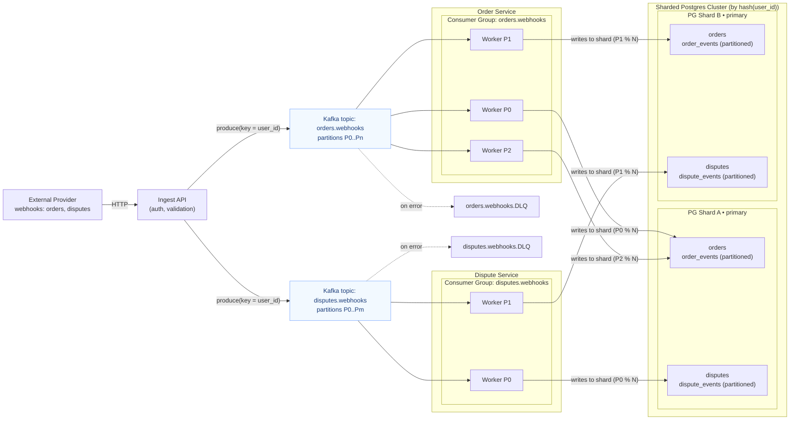

# Kafka Webhooks Architecture

Target architecture for async webhook processing with Kafka.

## Components

| Component | Description |
|-----------|-------------|
| **Ingest API** | HTTP endpoint for webhooks, validates and publishes to Kafka |
| **Kafka Topics** | `orders.webhooks`, `disputes.webhooks` - partitioned by `order_id` |
| **Consumer Groups** | One per topic, workers consume in parallel |
| **DLQ** | Dead Letter Queue for failed messages (future) |
| **Sharded Postgres** | Target architecture for scale-out (future) |
